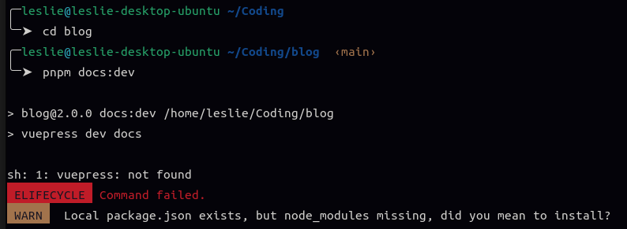
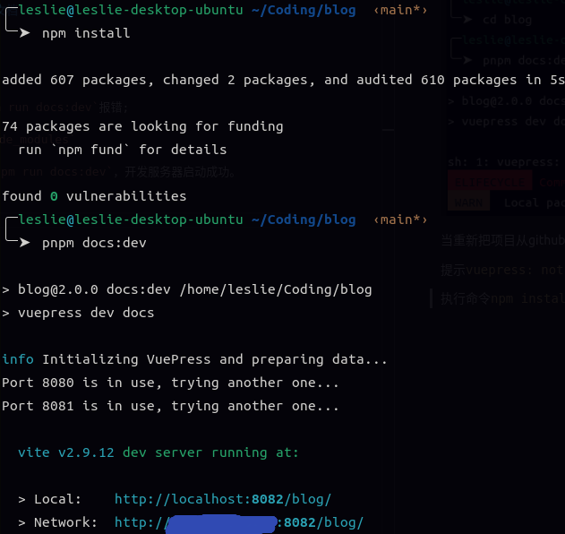

## 零、准备运行环境
[准备运行环境](https://vuepress-theme-hope.github.io/v2/zh/cookbook/tutorial/env.html)

## 一、pnpm run docs:dev报错

### 0. 背景 

 当重新把项目从github拉下来后，直接运行`pnpm run docs:dev`报错;

 提示`vuepress: not found`，需要先安装`node_modules`

<!-- ’ -->
 

 ### 1. 解决方法
 
 执行命令`npm install`
 
 完成安装后重新执行`pnpm run docs:dev`，开发服务器启动成功。

’
